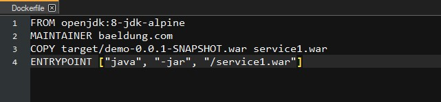

# Aplicacion con arquitectura de Microservicios

Desarrollado con React, Spring boot, Docker, AWS, Ionic, MariaDB y Linux.

Frontend con el framework React y Ionic.
Backend con el framework Springboot. 
Base de datos MariaDB.
Contenedores con Docker
La nube de AWS para el despligue de la aplicacion.

## Capturas de pantalla

### Sitio principal

### Captura 1

### Captura 2

### Captura 3

### Captura 4

### Captura 5

### Captura 6

### Captura 7

### Captura 8
